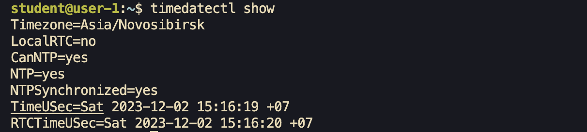
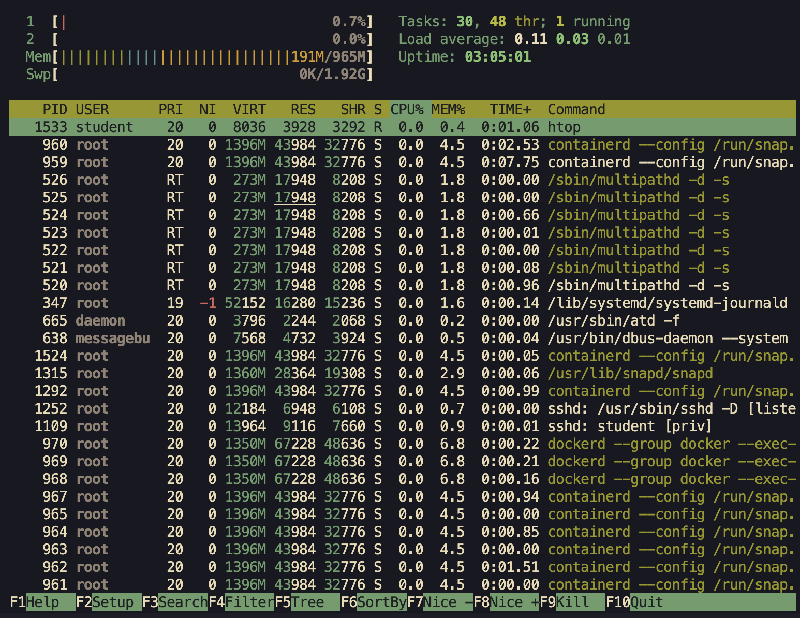
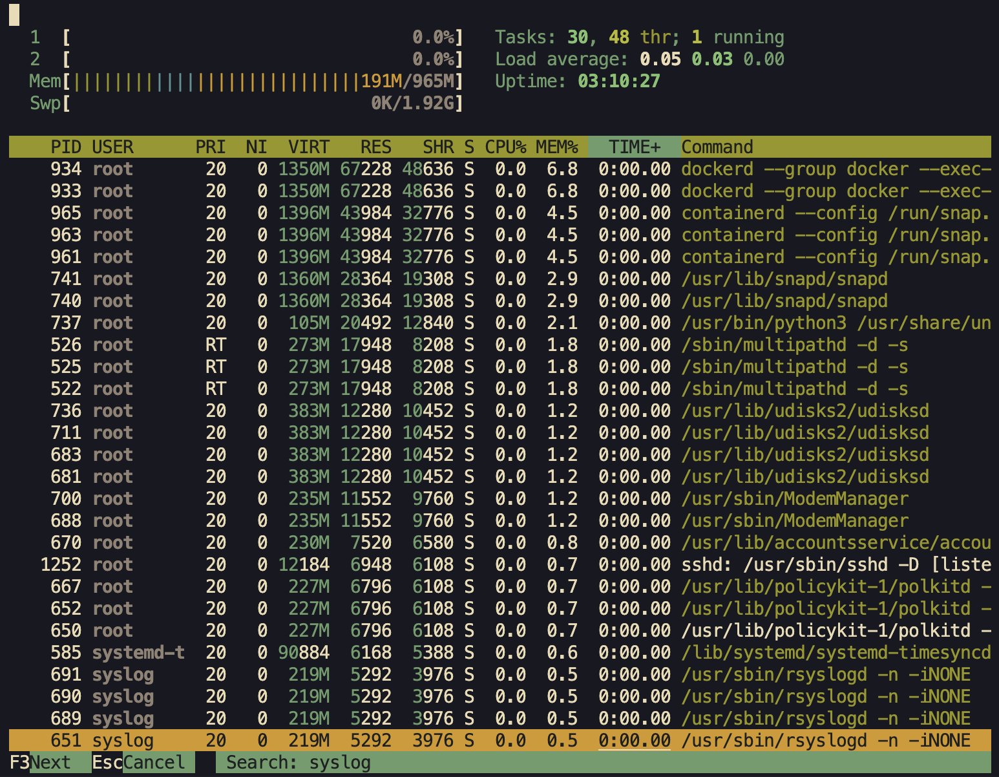

#Отчет конфигурации `Linux/Unix` систем.

##*Part 1. Установка ОС:*

###Установка Ubuntu 20.04.06


*<sup>Ввод комманды `cat` для вывода содержимого файла `etc/issue`</sup>*

##*Part 2. Создание пользователя:*

###Создание нового пользователя в группе adm

*<sup>Добавление нового пользователя user-1.</sup>*

Ввод комманды `useradd -G adm user-1`
Вывод файла `etc/passwd`


##*Part 3. Настройка сети ОС:*

- *Изменение имяни хоста на user-1*

- *Изменение часового пояса (`timezone`)*

- *Вывод сетевых интерфейсов*
  - *Можно так:*
  
  <sub>если установлен пакет `net-tools`</sub>
  - *Или же:*
  
  - >lo *(loopback device)* –виртуальный интерфейс, присутствующий по
    >умолчанию в любом Linux. Он используется для отладки сетевых
    >программ и запуска серверных приложений на локальной машине.
    >C этим интерфейсом всегда связан адрес `127.0.0.1`. У него есть
    >dns-имя – `localhost`.
- *Вывод ip адреса устройства, на котором вы работаете, от DHCP сервера*

  - >DHCP (англ. Dynamic Host Configuration Protocol — протокол
    >динамической настройки узла), позволяющий устройствам
    >автоматически получать IP-адрес, данные о DNS-сервере и другие
    >параметры, необходимые для работы в сети.

- *Вывод в консоль внешний ip-адрес шлюза (ip) и внутренний
   IP-адрес шлюза, он же ip-адрес по умолчанию (gw).*
  

- Задать статичные (заданные вручную, а не полученные от DHCP сервера) настройки ip, gw, dns.

  ```yaml
    #Конфиг на языке yaml
    #/etc/netplan/config.yaml

    network:
      version: 2
      renderer: networkd
      ethernets:
        enp0s3:
          dhcp4: false
          addresses:
            - 10.0.2.15/22
          gateway4: 10.0.2.2
          nameservers:
            addresses:
              - 8.8.8.8
              - 8.8.4.4
  ```
  затем
  ```bash
  sudo netplan apply
  ifconfig
  ```
  

  -Перезагрузить виртуальную машину. Убедиться, что статичные сетевые
  настройки (ip, gw, dns) соответствуют заданным в предыдущем пункте.
  ```bash
  sudo shutdown -r now
  ifconfig 
  ```
  Убедимся что вывод соответствует)
  

  Используем комманду ping `ip`
  ```bash
  ping ya.ru
  ...
  ping 1.1.1.1
  ```
  
  <sub>Вывод комманды ping</sub>

##*Part 4. Обновление ОС*
  - Далее обновляем нашу ос:
  ```bash
  sudo apt update && sudo apt upgrade
  ```
  

##*Part 5. Использование команды sudo*
  `sudo` - позволяет строго определенным пользователям выполнять указанные программы с административными привилегиями без ввода пароля суперпользователя root.
  - Разрешить пользователю, созданному в Part 2, выполнять команду sudo:
  Вводим комманду:
  ```bash
  sudo usermod -aG sudo user-1
  ```
  

##Part 6. Установка и настройка службы времени
  

##Part 7. Установка и использование текстовых редакторов
   -  jpico
    
      > c^s - save
       c^x - exit
   - vim
    
     > i - interactive mode
       esc - command mode
       :wq - save and exit
   - nano
    
     > c^s - save
       c^x - exit

  files 
  

  для выхода без сохранения используем:
  jpico
  c^x нас спросят сохранить ли буфер нажимаем n
  
  vim
  :q!
  
  nano
  c^x нас спросят сохранить ли буфер нажимаем n
  

  для замены используем:
  jpico
  `c^w` нас спросят что мы ищем далее G а затем на что мы хотим заменить
  
  vim
  `:s/mart/tram`
  
  nano
  `c^\` нас спросят что мы ищем а затем на что мы хотим заменить
  

##*Part 8. Установка и базовая настройка сервиса SSHD*
  - В большинстве дистрибутивах sshd установлен по умолчанию
  - Добавить автостарт службы при загрузке системы.
    ```bash
    sudo systemctl enable sshd
    ```
  - Перенастроить службу SSHd на порт 2022.
    
    
  - Используя команду ps, показать наличие процесса sshd.
    ```bash
    ps -d | grep ssh
    ```
  - Вывод комманды:
    ```bash
    netstat -tan
    ```
    `-t` - это протокол `tcp`
    `-a` - выводит информацию о всех сокетах(активных и не активных)
    `-n` - Отображает активные TCP-соединения, однако адреса и номера портов выражаются в цифрах, и попытки определить имена не предпринимаются.
    
     - Proto - в этом столбце находится протокол который мы используем
     - Local Addres - локальный IP-адрес участвующий в соединении или связанный со службой, ожидающей входящие соединения (слушающей порт).
     - Foreign Address - Внешний IP-адрес, участвующий в создании соединения.
     - State - состояние соединения
    
    **если в качестве аддреса используется 0.0.0.0 значит может использоваться любой аддрес**

##*Part 9. Установка и использование утилит top, htop*
####top
  - uptime можно узнать в верхнем левом углу(он подписан как up)
  
  - там же можно посмотреть колличество авторизированых пользователей и общую загрузку.
  - В пункте Tasks – общее количество запущенных процессов
  - Ниже можно посмотреть на загрузку cpy
  - А еще ниже на загрузку памяти
  - pid процесса занимающего больше всего памяти `shift+M`
  - pid процесса, занимающего больше всего процессорного времени `shift+P`
####htop
  - вывод команды htop отсортированный по PID, PERCENT_CPU, PERCENT_MEM, TIME
    
    
    
    
  - отфильтрованному для процесса sshd
    
  - с процессом syslog, найденным, используя поиск
    
  - с добавленным выводом hostname, clock и uptime
    

##*Part 10. Использование утилиты fdisk*
  - Нaзвание жесткого диска `/dev/sda`
  - его размер `17179869184 bytes`
  - количество секторов `33554432 sectors`
  - размер swap `1.9Gi`

##*Part 11. Использование утилиты df*
  - Используем утилиту df без флагов
    ```bash
    df /
    ```
    - размер корневого раздела 16400252
    - размер занятого пространства 6381200
    - размер свободного пространства 9163964
    - процент использования 42
    - единица измерения Килобайты
  - Используем утилиту df с флагами Th
    ```bash
    df -Th /
    ```
    - размер корневого раздела 16G
    - размер занятого пространства 6.1G
    - размер свободного пространства 8.8G
    - процент использования 42%
    - единица измерения Гигабайты

    - тип файловой системы для раздела ext4

##*Part 12. Использование утилиты du*

  - Вывести размер папок /home, /var, /var/log
    - в байтах
    
    - в человекочитаемом виде
    
  - Вывести размер всего содержимого в /var/log 
    

##*Установка и использование утилиты ncdu*
  - Вывести в /var /home
    
  - Вывести в /var/log
    

##*Part 14. Работа с системными журналами*
  - время последней успешной авторизации, имя пользователя и
  метод входа в систему
  ```log
  Dec  2 22:21:02 gehnmartpc sudo: pam_unix(sudo:session): session closed for user root
  ```
  - скрин с сообщением о рестарте службы
  
